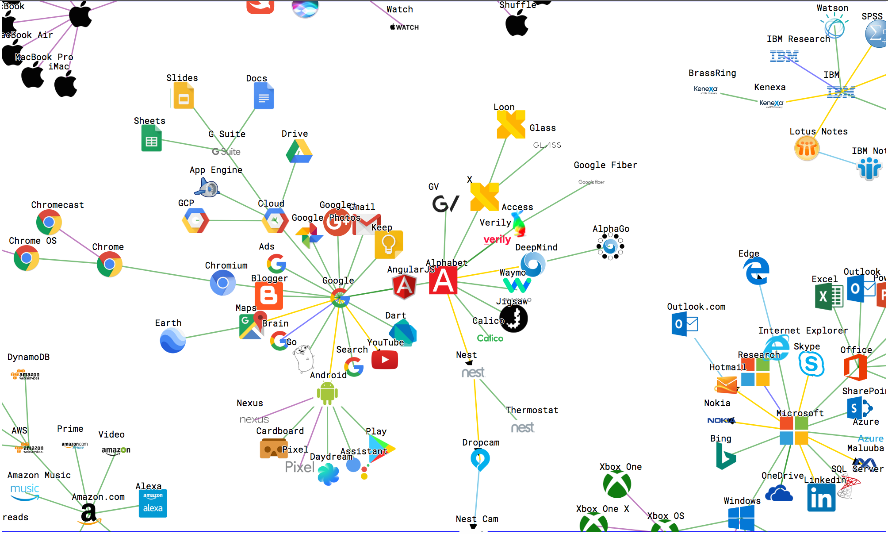

# A Graph of Tech

A force-directed graph of notable tech companies, their products, and services.
View the full interactive graph [here](https://nchah.github.io/tech-graph/).

**Disclaimer: All information on this page is presented for informational purposes only. There is no affiliation with any of the companies shown here.**

## Contents

  * [Contents](#contents)
  * [Introduction](#introduction)
  * [Methodology](#methodology)
  * [Limitations](#limitations)
  * [The Graph](#the-graph)
     * [General Findings](#general-findings)
     * [Alphabet](#alphabet)
     * [Amazon](#amazon)
     * [Apple](#apple)
     * [Facebook](#facebook)
     * [IBM](#ibm)
     * [Microsoft](#microsoft)
     * [Yahoo](#yahoo)
  * [Sources](#sources)

## Introduction

This graph started as a side project one weekend in response to some recurring trends I saw in tech.
(1) Acquisitions in tech are significant.
A company was acquired by [TECH_GIANT]. Why did they acquire them and what's the impact? What else do they own?
(2) Recent advances in machine learning and Artificial Intelligence mean there's greater attention on tech companies and startups.
So it may be worthwhile to map out the various entities that fall under each major tech company.

This graph can be interpreted on different levels.
At a surface level, this is a fun and interactive visualization.
Move the clusters around and rearrange their links, observing what links to what.
At another level, this graph may show how the different companies are structured and how this is a reflection of their operations and culture.
In other ways, this graph may lend itself well to arguments for exercising caution in how one consumes the vast technological offerings presented by these companies.
The possible use cases can range from the simple to the complex, and are open to interpretation.

## Methodology

The scope of this graph had to fall into a respectable range that balanced a few trade-offs.
On one hand, a graph of all acqusitions and products by each company may be comprehensive, but it would need a commensurate amount of time and effort.
On the other hand, only graphing the most "notable" products leads to the question of how notability should be determined.
This is still a valid concern but it was resolved for now by using Wikipedia as a reference for notability.

Most of the information used to build the graph was collected from Wikipedia.
The Navigation Boxes were especially helpful as they served as a rough proxy for what products/services were notable enough to have their own Wikipedia page.
The company and product logos used in the visualization were collected from various web sources, with most from Wikipedia.

The first implementation was in Python using the `matplotlib` and `networkx` libraries.
However, the resulting static pngs didn't have the interactiveness that make some nice visualizations all the more impactful. For that, I switched the stack to use JavaScript and the [D3.js](https://d3js.org/) library. 

## Limitations

It's worth pointing out where this graph fall short.

- Temporality is not represented in the graph. That is, changes in ownership of companies/products over time are not depicted.
- As mentioned already, the graph does not show all products and services offered by a company.
- (Unintentional) bias will be present in the graph. How and why certain nodes are linked as they are is certainly open to discussion. This is similar to the ontological questions in how knowledge is represented in knowledge graphs.

## The Graph

### General Findings

- Many tech companies have an AI-assisted personal assistant in the market.
- 

### Alphabet

- The graph shows Alphabet/Google after it was restructured in 2015. It's quite apparent that Google has the largest product offerings out of the other subsidiaries.
- Most of the Google products were linked directly to the Google node. There is some branching shown with Android, Chrome, and the Cloud products.
- It was difficult to find additional nodes to link to some of the other Alphabet subsidiaries like Calico and Jigsaw.

### Amazon

- There are separate nodes for Amazon and Amazon.com in an attempt to distinguish between the main Amazon products and other subsidiaries, like Whole Foods.
- With regards to subsidiaries, Amazon have many and they were not all shown here.
- Amazon Web Services (AWS) offers a large range of products. It was an arbitrary decision to just link to a few of those nodes.

### Apple

- The Apple graph is structured around the different operating systems that the company maintains. This consistency made it easier to model how Apple software was linked to its various hardware products.
- There's a separate branch for "Apps". Otherwise, linking them directly to the Apple node made the cluster very crowded and unreadable.

### Facebook

### IBM

### Microsoft

### Yahoo

## Roadmap

## Sources

